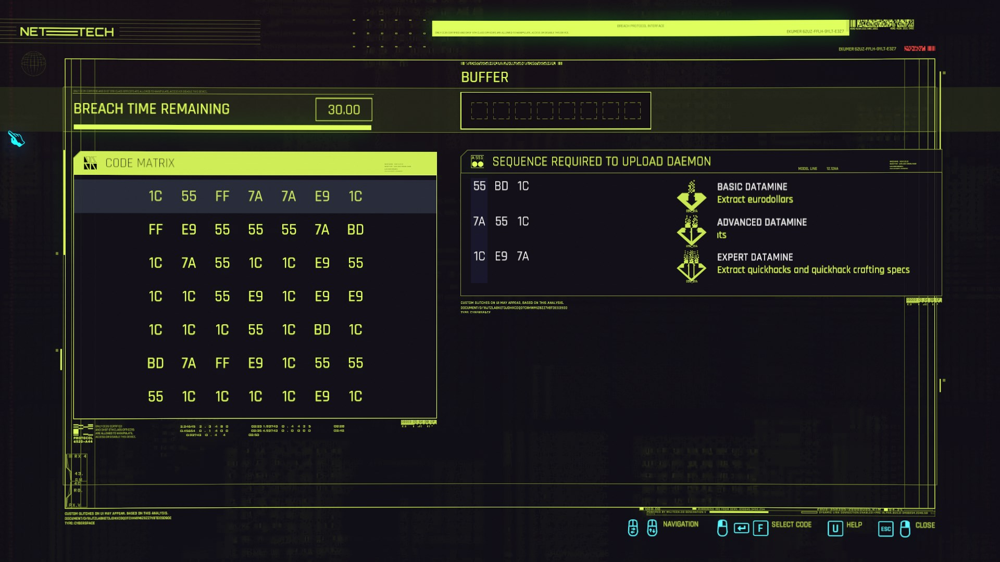
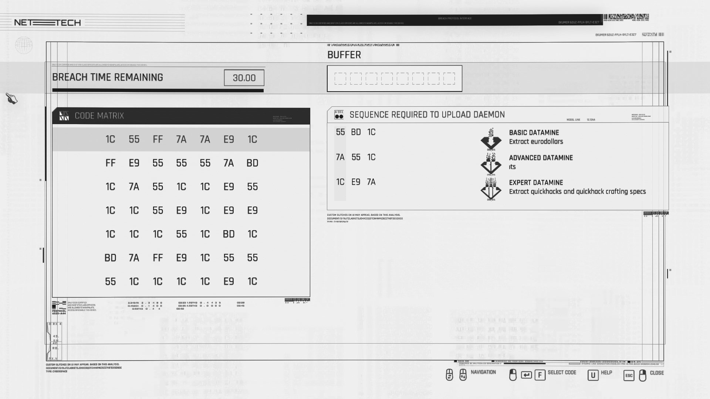
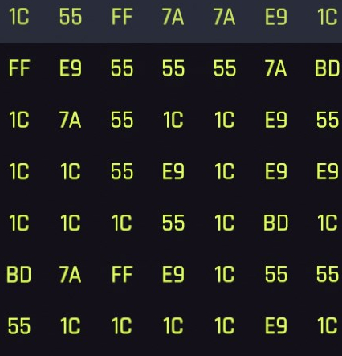
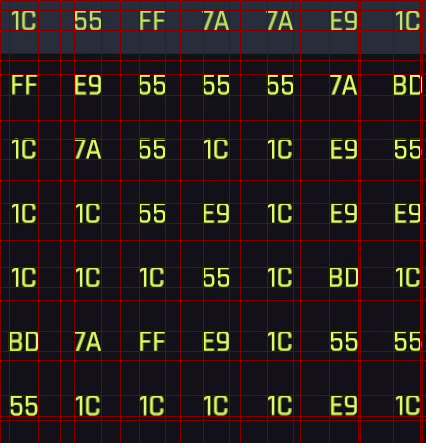

# Cyberpunk Solver

## About
I was a little bit late to the party when it comes to playing Cyberpunk 2077. I watched a lot of reviews and the bugs were a turnoff at the time. But after playing it (even after encountering a bug that stopped my progress), I really liked it. But while playing, I had to solve the cyber puzzle thingie. Which got me an idea: Why solve it if I can waste my time automating it?

Now I know most probably a ton of trainers already available to do it for me. Or I could have read some data from the game's memory and then manipulated some data to solve it BUT where's the fun in that?

## How does it solve it?
1. First we have the image



2. We manipulate this image in order to make the features extraction a little easier


3. Then we extract the relevant parts of the image like the matrix



4. After doing so, we detect the areas and get the dto to both get the solution and get the dto and coordinates to solve it



6. Now that we have extracted the needed data it should look something like this (see [HERE](./docs/results/2022-15-12_12-07-04c76539ab-cba0-4970-93c4-c3e98c540484.json) for shape with coordinates)
```json
{
  "buffer_size": 8,
  "sequences": [
    ["55", "BD", "1C"],
    ["7A", "55", "1C"],
    ["1C", "E9", "7A"]
  ],
  "matrix": [
    ["1C", "55", "FF", "7A", "7A", "E9", "1C"],
    ["FF", "E9", "55", "55", "55", "7A", "BD"],
    ["1C", "7A", "55", "1C", "1C", "E9", "55"],
    ["1C", "1C", "55", "E9", "1C", "E9", "E9"],
    ["1C", "1C", "1C", "55", "1C", "BD", "1C"],
    ["BD", "7A", "FF", "E9", "1C", "55", "55"],
    ["55", "1C", "1C", "1C", "1C", "E9", "1C"]
  ]
}
```

7. The code then can check for a [solution](./src/solver/matrix_solver.py)
```python
def generate_merged_combinations(
    sequences: List[List[str]], buffer_size: int
) -> Generator[List[str], None, None]:
    for number_of_sequences in range(len(sequences), 0, -1):
        for permutation in itertools.permutations(sequences, number_of_sequences):
            if len(merged := merge_sequences(permutation)) <= buffer_size:
                yield merged
```


## How to run?

First vreate a virtual environment by running `python -m venv .venv`

Then activate it with `source .venv/bin/activate` (on linux/mac) or `.venv\Scripts\activate` (on windows)

Finally, install the requirements with `pip install -r requirements.txt`


## TODOs
- [ ] tokenize tokens for better performance
- [ ] Ceate a tree or a set to help looking up to values instead of scanning the whole 2d matrix
- [ ] A lot of optimizations maybe combining the generator and matrix search, cache pathes etc
- [ ] Refine AI and OCR and push to github
- [ ] Add auto screenshot tool
- [ ] Add keyboard shortcut
- [ ] add auto clicker to solve with feedback in case of mistake
- [ ] add starting with something that is not in the sequence and  intermediary steps